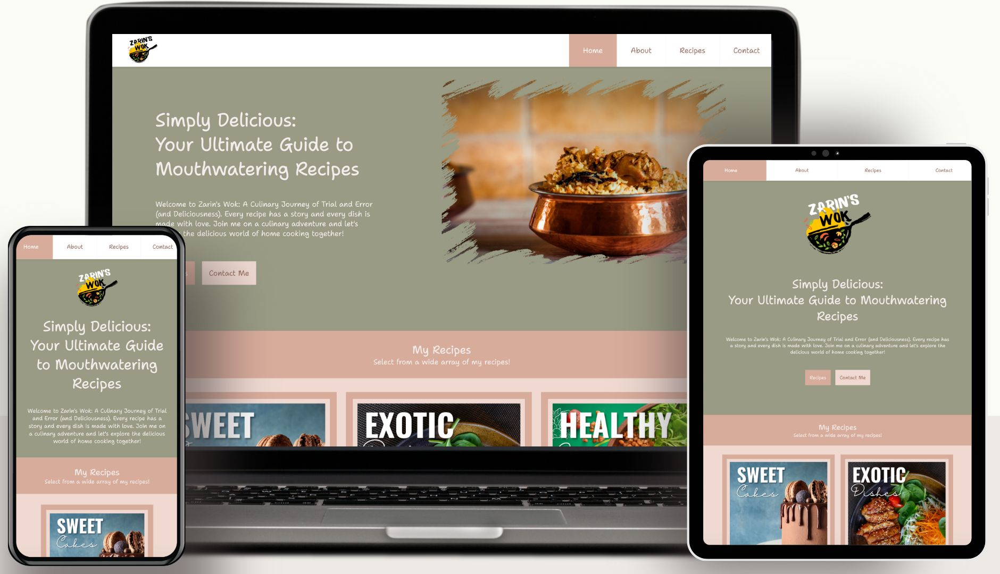
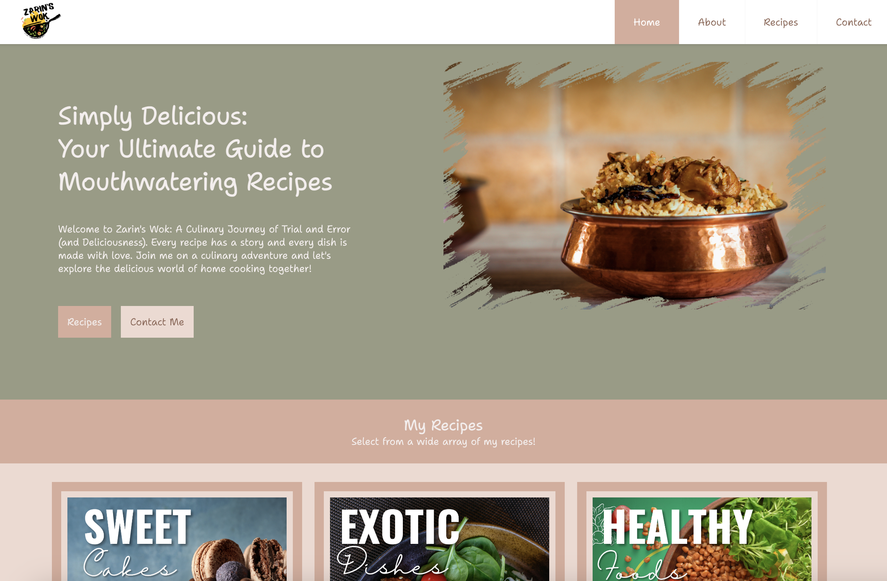
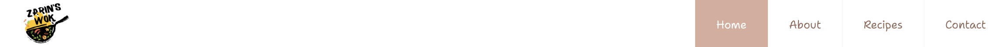
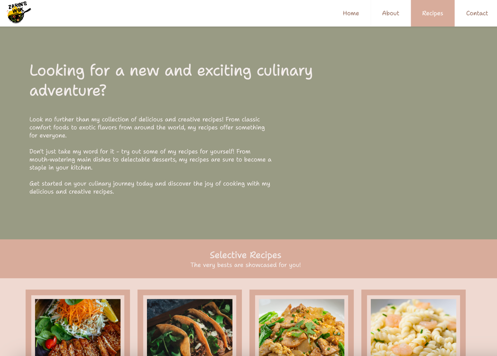
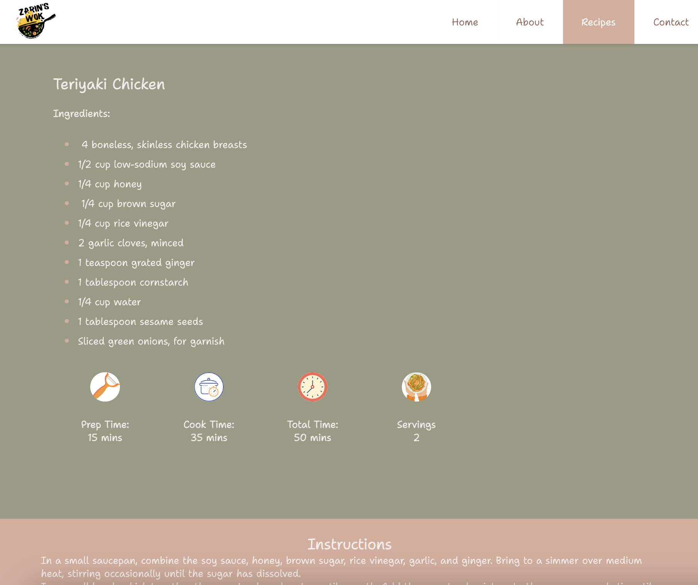
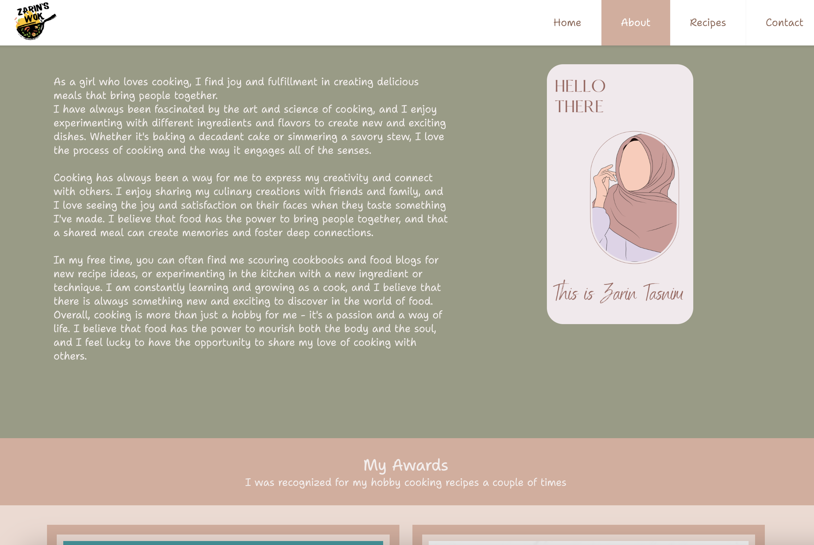
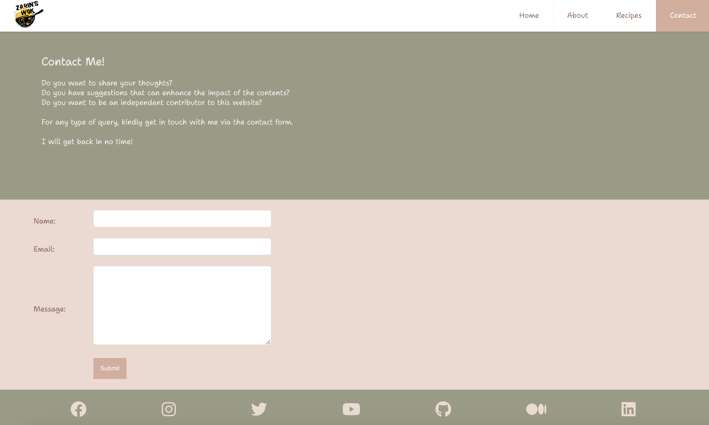
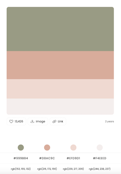
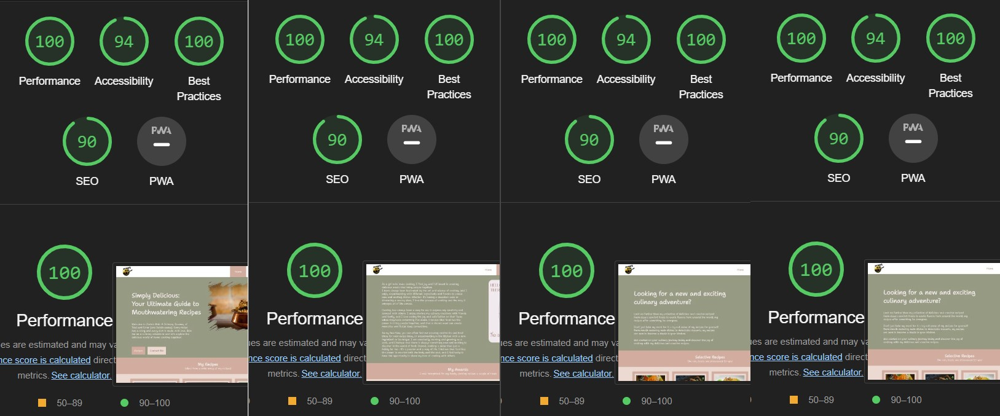
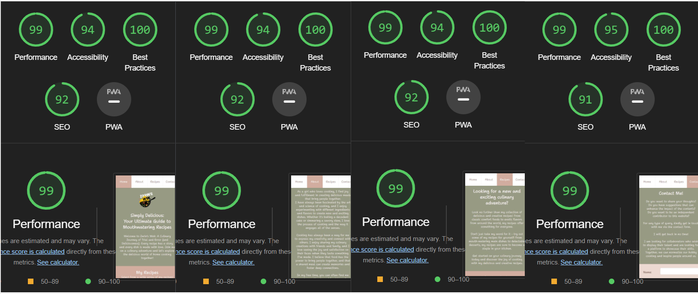

# Zarin's Wok
[Zarin's Wok](https://zarin-tzp.github.io) is the go-to source for delicious and easy-to-follow recipes for every occasion. This website is dedicated to providing the visitors with a wide range of recipes & cooking tips to help them create mouth-watering meals in their own kitchen.
This is a static website that uses HTML and pure CSS (no CSS framework and no JavaScript were used).

## Purpose
This niche of this website revolves around 'Recipe'. The purpose of this website is to demonstrate the learnings of the lessongs for HTML & CSS under the Code Institute training.

## Design motivation
- User-Friendly: The website is designed with the end user in mind, making it easy for them to navigate and find what they're looking for.

- Visual Appeal: Since food is a visual medium, the website design is visually appealing and showcases the dishes in an appetizing way.
  - High-quality paid images and graphics were used to enhance the user's experience and increase the engagement with the website.

- Mobile Optimization: The website is optimized for mobile devices and changes layout to ensure a seamless user experience across all devices.

- Branding: This website is an opportunity to build a strong start that is associated with high-quality content.

- Accessibility: The website is accessible to all users, including those with disabilities. This was achieved by using clear and legible font that complements the topic, professional color combination, and alternative text for images.

## Goal: External users
- Finding a specific recipe: Users can visit the website to find a specific recipe they have in mind. They may look for a recipe for a particular dish or cuisine.

- Exploring new recipes: Users can try out new recipes and experiment with new ingredients, techniques, and cuisines.

- Sharing recipes: Users can share their favorite recipes with friends and family.

- Learning cooking skills: Users can learn new cooking skills and techniques.

## Goal: Business
- Producing professional content: To provide valuable content to the users in the form of recipes.

- Generating revenue: To generate revenue through various methods, such as advertising, sponsored content, affiliate marketing etc.

- Growing the brand: To help build a strong brand that is associated with high-quality content and expertise in cooking.

## Website at a glance

### Responsiveness
Every webpage changes its layout based on the device (computer browser, tab browser or mobile browser). 
Elements can switch visibility based on the screen size.
 
 
<kbd>

</kbd>
 
 
### Homepage
The landing page acts as the eye cather of the entire website. It briefly explains the concept of the website.
 
 
<kbd>

</kbd>
 
 
### Header
The navigation menu items are self-explanatory. The layout changes in mobile view & the menu items expands in width for better usability.
 
 
<kbd>

</kbd>
 
 
### Recipes
The core page & the highlight of the website. It contains the recipe list from where users can navigate to the recipes.
 
 
<kbd>

</kbd>
 
 
### Recipe Details
The detailed page of a recipe. Apart from the recipe, it contains some helpful information about the preparation of the dish.
 
 
<kbd>

</kbd>
 
 
### About
The page includes a brief background about myself. It highlights my motivation behind this. A couple of relevants awards are enlisted to boost up user trust.
 
 
<kbd>

</kbd>
 
 
### Contact
The page includes a contact form that demonstrates the contact functionality of the website.
 
 
<kbd>

</kbd>
 
 
### Footer
The footer contains the social media URLs (with dummy external URL)
 
 
<kbd>

</kbd>
 
 
## Theme
The following theme was selected after shortlisting from hundreds of themes.
This goes well with the highlights of the website and is not a high contrast website. It gives the user a native feeling to the elements of the website.
 
 
<kbd>

</kbd>
 
 
## Font
The google font 'Shantell Sans' was used as the primary font face.

## Testing

This website is completely responsive.I have tested all the pages of this website using Lighthouse tools. The results are:

## Desktop
 
<kbd>

</kbd>
 
 

## Mobile
 
<kbd>

</kbd>
 
 

- All the HTML of this website has been tested through [W3C HTML validator](https://validator.w3.org/) and passed without any errors.
- All the CSS of this website has been tested through [W3C CSS validator](https://jigsaw.w3.org/css-validator/) and passed without any error.

## Deployment

This website was deployed on a github.io page.The steps to push the code to the github repository are:
- Download github desktop app
- Clone the repository
- Modify the code
- Commit and push the code to the master branch
- As soon as a new commit is pushed or merged to master, the [zarin-tzp github io](https://zarin-tzp.github.io/) page will be synced within minutes. The pipeline used for the deployment is github.io's internal process.

## External sources
- [Canva: paid images](canva.com)
- [Color Picker](https://colorhunt.co/)
- [google font](https://fonts.google.com/specimen/Shantell+Sans)

_Code from external sources: None_

## Development Process
- Process: Iterative
- Repository: Github
- Branch: master
